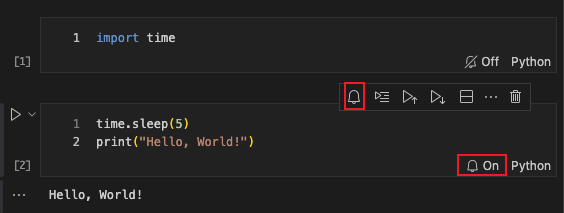

# Jupyter Cell Notifier
 

A VS Code extension to notify you when individual Jupyter notebook cells finish executing.

---

## Features

- Bell icon in each cell’s toolbar to toggle notifications  
- Desktop & notification‐center alerts when cells complete  
- Click a notification to jump right back to that cell  

---

## Preview

---

## Requirements

- VS Code ≥ 1.74.0  
- [Python](https://marketplace.visualstudio.com/items?itemName=ms-python.python) & Jupyter extension for `.ipynb` support  

---

## Installation

### From the Marketplace

1. Open **Extensions** (`Ctrl+Shift+X`)  
2. Search for **“Jupyter Cell Notifier”**  
3. Click **Install**

## Usage

1. Open a Jupyter notebook in VS Code
2. Look for the bell icon (🔔) in the cell toolbar
3. Click the bell icon to enable notifications for that cell
4. Run the cell - you'll receive a notification when it completes
5. Click the notification to jump to the cell or disable future notifications

## Contributing

Feel free to submit issues and enhancement requests!

## License

MIT